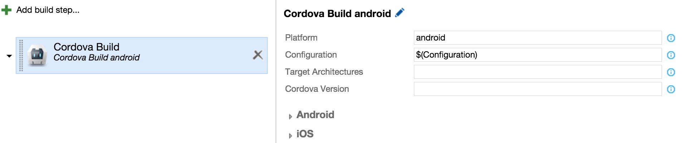
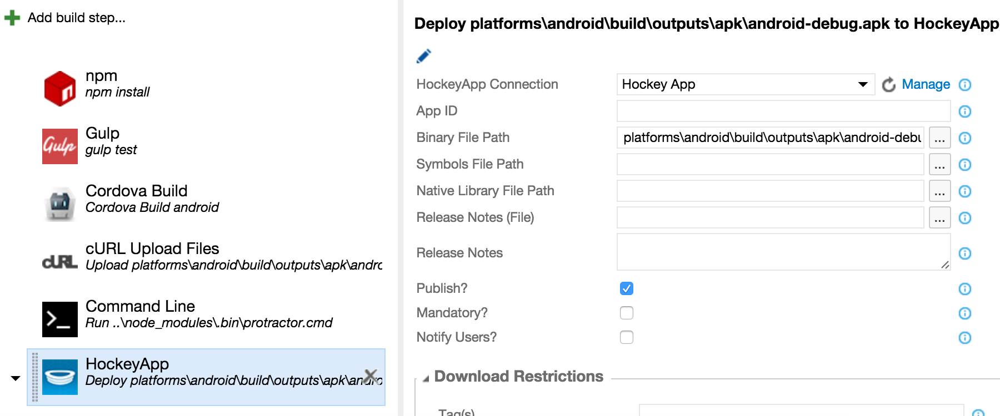
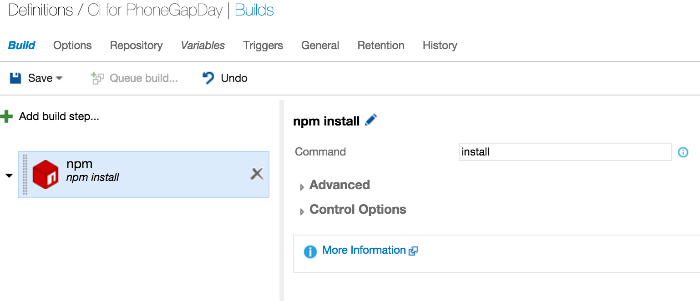
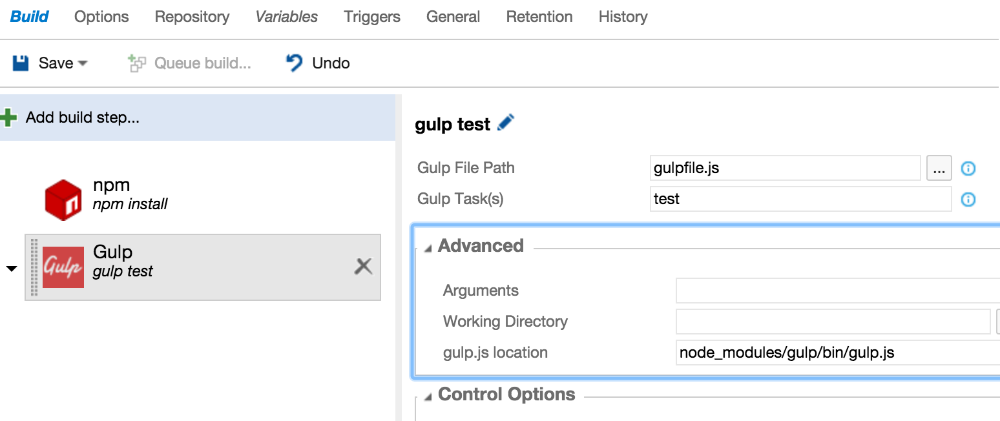
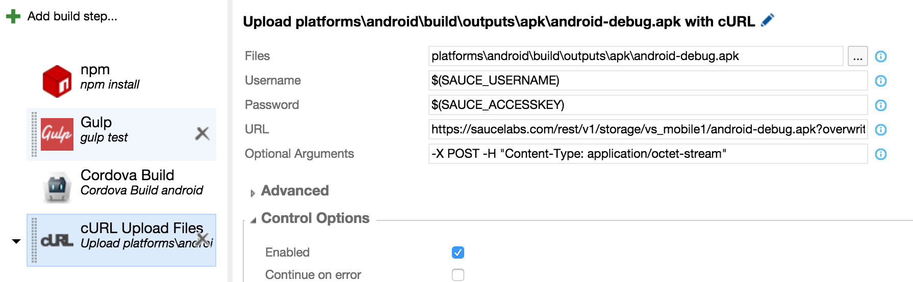
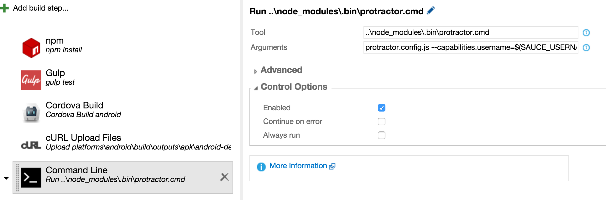

#How to setup CI using VSTS 2015

Lot of good information, [here](https://msdn.microsoft.com/en-us/library/vs/alm/build/cordova/cordova-build), but lets do it ourselves!!

##Sign up into VSTS
First, sign up for Visual Studio Team Services
- Create a new VSTS account by going to visualstudio.com and signing in with a Microsoft account (hotmail, outlook, live.com, etc) and use it [here](www.visualstudio.com/en-us). 
- Create a new project in that account

##Create build definition
- Click on the store icon in the account and install the Cordova Extension for Visual Studio Team Services
- Next create a build definition, by going to the Build tab in your Team Services project and clicking the “+” icon to create a new build definition. Select the Empty template
    - When setting up the definition, specify “github” as the repo
    - Go to the “Repository” tab for the definition and clicked “Manage Connections”
    - Create a new github connection through 'New Service Endpoint"
    - Go to github.com and Create a new personal access token which is used for the connection (Recommended scopes -- repo, user, admin:repo_hook)

- Use the resulting connection as our source repo
 
##Build the package
- Install the [Cordova Extension](https://marketplace.visualstudio.com/items/ms-vsclient.cordova-extension) for VS Team Services.
- Click **Add Build Step** and select *Cordova Build* from the Build category. Use the following settings: 
    - Platform: android
    - Configuration: debug or release  (set in Variables)
    - Cordova Version: This is pulled from taco.json if you are using VS Tools for Apache Cordova or the TACO CLI, Otherwise you’ll want to enter a version here (*default* : 5.3.3)
    - iOS/Android: Add certs/keys/provisioning profiles as necessary
 
  
 
  >**Note**:
In order to build for iOS, you can use the [cross platform agent](https://www.npmjs.com/package/vsoagent-installer) or the [PhoneGap remote build](https://build.phonegap.com) (if you have a PhoneGap account)

###Deploy to HockeyApp (http://hockeyapp.net/features/)
- Install the [HockeyApp Extension](https://marketplace.visualstudio.com/items/ms.hockeyapp) for VS Team Services.
- Go to Account Settings on the HockeyApp site, choose API Tokens, and grab the details of your access token.
- Back on the Team Services site, go to the control panel (via the gear icon in the upper right hand corner) and click on Services tab.
- Click New Service Endpoint, select HockeyApp, and enter a name along with your access token. 
- Next, go back to the build definition you created above and add the HockeyApp build step from the Deploy category and move it after Cordova Build. Use the following settings:
    - HockeyApp Connection: Select the name of the service endpoint you created above.
    - Binary File Path:platforms\android\build\outputs\apk\android-debug.apk.
    - Symbols File Path: (For iOS only) This is needed for native crash statistics which we will configure later. By default these land in bin/ios/[configuration]/[app name].dSYM for the Cordova Build task.

  

##[Optional]Install all the dependencies (Karma, Jasmine etc) 
- Add the npm step from the **Package** category with 'install' as the Command and --no-optional --force under Advanced > Arguments.

    
    
##[Optional]Gulp task for running unit tests
- Add the Gulp step from the **Build** category and configure it to run the test task
- *Optional:* Add the *Publish Test Results* task from the **Test** category and use tests/_results/*.xml for Test Results Files and be sure to check Control Options > Always run.
    
    

##[Optional] Run UI Tests on SauceLabs
We are using an existing account already setup for this workshop. 

###Upload the built package to SauceLab
- Click **Add Build Step** and select *cURL Upload Files* from the Utility category. Use the following settings: 
    - Files: platforms\android\build\outputs\apk\android-debug.apk
    - UserName: $(SAUCE_USERNAME):  This is your saucelab username.
    - Password: $(SAUCE_ACCESSKEY) : This is your sauce lab access key
    - URL: https://saucelabs.com/rest/v1/storage/vs_mobile1/android-debug.apk?overwrite=true
    - Optional Arguments: -X POST -H "Content-Type: application/octet-stream"

  
  
###Run tests on saucelab
- Click **Add Build Step** and select Command line from the Utility category. Use the following settings: 
    - Tool: ..\node_modules\.bin\protractor.cmd
    - Arguments: protractor.config.js --capabilities.username=$(SAUCE_USERNAME) --capabilities.accesskey=$(SAUCE_ACCESSKEY)
    - Advanced > Working Folder: tests
 
  
